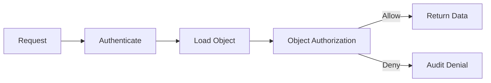

# Diagram — API Authorization Flow

## Diagram

```mermaid
flowchart LR
  Req[Request] --> AuthN[Authenticate]
  AuthN --> Obj[Load Object]
  Obj --> AuthZ[Object Authorization]
  AuthZ -->|Allow| Data[Return Data]
  AuthZ -->|Deny| Log[Audit Denial]
```

## Notes

Authentication is not object authorization. The object owner and action must be checked server-side.
