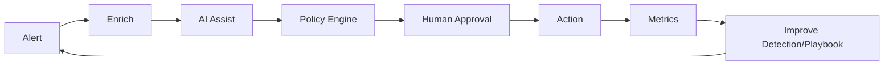

# Diagram — Autonomous SOC Feedback Loop

## Diagram

```mermaid
flowchart LR
  Alert --> Enrich
  Enrich --> Assist[AI Assist]
  Assist --> Policy[Policy Engine]
  Policy --> Approval[Human Approval]
  Approval --> Action
  Action --> Metrics
  Metrics --> Improve[Improve Detection/Playbook]
  Improve --> Alert
```

## Notes

AI can assist, but policy, approval, and audit logs control high-risk actions.
