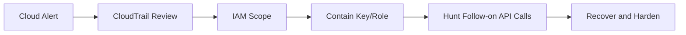

# Diagram — Cloud Incident Response Flow

## Diagram

```mermaid
flowchart LR
  Alert[Cloud Alert] --> CT[CloudTrail Review]
  CT --> IAM[IAM Scope]
  IAM --> Contain[Contain Key/Role]
  Contain --> Hunt[Hunt Follow-on API Calls]
  Hunt --> Recover[Recover and Harden]
```

## Notes

Cloud IR depends on control-plane evidence and fast credential containment.
