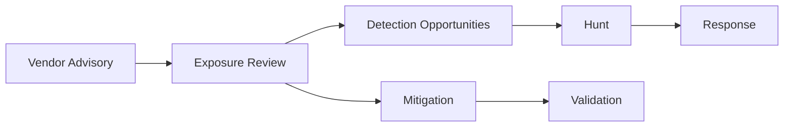

# Diagram — CVE to Detection Flow

## Diagram

```mermaid
flowchart LR
  A[Vendor Advisory] --> E[Exposure Review]
  E --> M[Mitigation]
  E --> D[Detection Opportunities]
  D --> H[Hunt]
  H --> R[Response]
  M --> V[Validation]
```

## Notes

CVE work should connect patching and detection rather than treating them separately.
