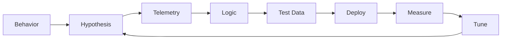

# Diagram — Detection Engineering Lifecycle

## Diagram

```mermaid
flowchart LR
  B[Behavior] --> H[Hypothesis]
  H --> T[Telemetry]
  T --> L[Logic]
  L --> Test[Test Data]
  Test --> Deploy[Deploy]
  Deploy --> M[Measure]
  M --> Tune[Tune]
  Tune --> H
```

## Notes

Detection engineering is a lifecycle, not a one-time query.
