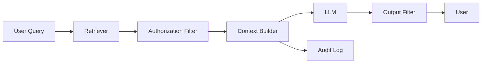

# Diagram — RAG Trust Boundary

## Diagram

```mermaid
flowchart LR
  U[User Query] --> R[Retriever]
  R --> ACL[Authorization Filter]
  ACL --> C[Context Builder]
  C --> LLM[LLM]
  LLM --> O[Output Filter]
  O --> User[User]
  C --> Audit[Audit Log]
```

## Notes

Retrieved content is data, not instruction. Authorization must happen before retrieval output is used.
