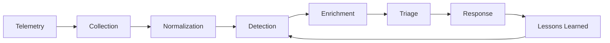

# Diagram — SOC Reference Architecture

## Diagram

```mermaid
flowchart LR
  T[Telemetry] --> C[Collection]
  C --> N[Normalization]
  N --> D[Detection]
  D --> E[Enrichment]
  E --> Q[Triage]
  Q --> R[Response]
  R --> L[Lessons Learned]
  L --> D
```

## Notes

This diagram shows the feedback loop that keeps a SOC improving after incidents and alert reviews.
