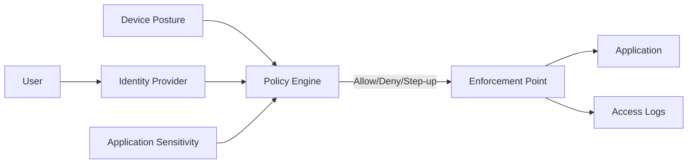

# Diagram — Zero Trust Access Flow

## Diagram

```mermaid
flowchart LR
  U[User] --> I[Identity Provider]
  D[Device Posture] --> P[Policy Engine]
  I --> P
  A[Application Sensitivity] --> P
  P -->|Allow/Deny/Step-up| E[Enforcement Point]
  E --> App[Application]
  E --> Log[Access Logs]
```

## Notes

Access decisions should use identity, device, application sensitivity, and risk context.
